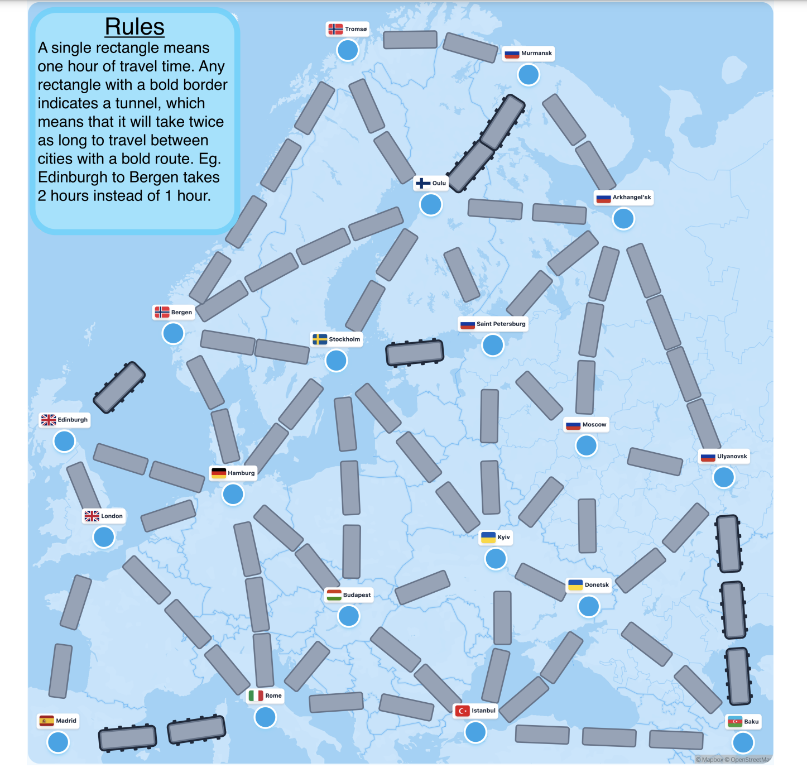

# 🌏 Dijkstra and A*(A-star) Algorithm Application

## Introduction
Dijkstra and A* Algorithm are  widely used algorithms to solve the single-source shortest path problem in graphs with non-negative edge weights. It is applicable in fields like network routing and mapping.

For more information, check the [Wikipedia on Dijkstra's Algorithm](https://en.wikipedia.org/wiki/Dijkstra%27s_algorithm) 
and [Wikipedia on A-star Algorithm](https://en.wikipedia.org/wiki/A*_search_algorithm).

## How to run

### - Dijkstra Algorithm 

#### 1. Local Execution

To run the algorithm locally, follow these steps:

1. Clone the repository:
   ```bash
   $ git clone git@github.com:phy-guanzh/Dijkstra_Astar_algorithm.git
   ```
2. Run the script:
    ```python
   python Dijkstra_main.py -f [file_path] -s [start_point] -e [end_point] -u [cost_unit]
   ```
   
   - **`file_path`**: Path to the map file (e.g., `data/network.csv`). If omitted, the default `data/network.csv` file will be used.
   - **`start_point`**: The starting node for the algorithm.
   - **`end_point`**: The target node. If omitted, all possible routes from the start point will be displayed.
   - **`cost_unit`**: The unit of cost. If omitted, unit hour(h) will be used.

#### 2. Streamlit Dashboard

A Streamlit dashboard is provided, offering an interface and additional functionality. More infomation about this template can be found in the [Link](https://github.com/streamlit/gdp-dashboard-template).  

You can either access the online application or run it locally.

1. **Online dashboard application**

   Please go to [](https://dashboard-dijkstra-zhe.streamlit.app/)

2. ##### Run dashboard application locally

   (1) Install the **requirements**

   ```bash
   $ pip install -r requirements.txt
   ```

   (2) Start the Streamlit dashboard application

   ```bash
   $ streamlit run streamlit_app.py
   ```

### - A* Algorithm 

The main framework for A* is the same as the framework for Dijkstra Algorithm, but the cost function `_find_closest_outpoints` would be 

$$Y(i) + l_{i j} + h(j)$$ 

where the heuristic function $h(j)$ is to estimate the cost from current node $j$ to the end target $t$. In this project, the Euclidean Distance is the heuristic function.

$$ H(j, t) =\sqrt{(\Delta_{jt} \text { Latitude })^2+(\Delta_{jt} \mathrm{Longitude})^2} $$

To run A* algorithm locally, follow these steps:

1. Clone the repository:
   ```bash
   $ git clone git@github.com:phy-guanzh/Dijkstra_Astar_algorithm.git
   ```
2. Run the script:
    ```python
   python Astar_main.py -f [file_path] -w [heuristics_data]-s [start_point] -e [end_point] -u [cost_unit]
   ```
   
   - **`file_path`**: Path to the map file (e.g., `data/network.csv`). If omitted, the default `data/network.csv` file will be used.
   - **`heuristics_data`**: Heuristics data applied to the map file (e.g., `data/city_coordinates.csv`). 
   - **`start_point`**: The starting node for the algorithm.
   - **`end_point`**: The target node. If omitted, all possible routes from the start point will be displayed.
   - **`cost_unit`**: The unit of cost. If omitted, unit hour(h) will be used.
   
## Local Execution Example

   1. **Example1:** <br>
   
      
   
      the input map file should follow csv format:  <br>

      ```css
      ,A,B,C,D,E
      B,2.0,,,,4.0
      D,1.0,,3.0,,1.0
      A,,2.0,,1.0,
      E,,4.0,2.0,1.0,
      C,,,,3.0,2.0
      ```
      which is from `data/default.csv`. <br>
   
      *Find the shortest path from Point A to C:*
      ```python
      python Dijkstra_main.py -f data/default.csv -s A -e D
      ```
        
      *Output:*
      ```
      Welcome Dijktra Algorithm
         Map will be processed: 
               A    B    C    D    E
         A  NaN  2.0  NaN  1.0  NaN
         B  2.0  NaN  NaN  NaN  4.0
         C  NaN  NaN  NaN  3.0  2.0
         D  1.0  NaN  3.0  NaN  1.0
         E  NaN  4.0  2.0  1.0  NaN
         Start Point: A 
         End Point: C 
         Time: 4.0, 
         Path: A->D->C or A->D->E->C 
      ```
   
   
   2. **Example2:** <br>
    <br>
   
      csv file can be viewed in `data/network.csv`.

      *Find the shortest path from Arkhangelsk to London:*
   
      ```python
      python Dijkstra_main.py -f data/network.csv -s Arkhangelsk -e London
      ```
      or A* Algorithm:
      ```python
       python Astar_main.py -f data/network.csv -w data/city_coordinates.csv -s Arkhangelsk -e London
      ```
      *Output*
      ```
      Welcome Dijktra/Astar Algorithm
         Map will be processed: 
         ...
         [19 rows x 19 columns]
         Start Point: Arkhangelsk 
         End Point: London 
         Time: 7.0, 
         Path: Arkhangelsk->Oulu->Stockholm->Hamburg->London or Arkhangelsk->Saint Petersburg->Stockholm->Hamburg->London 
      ```
      